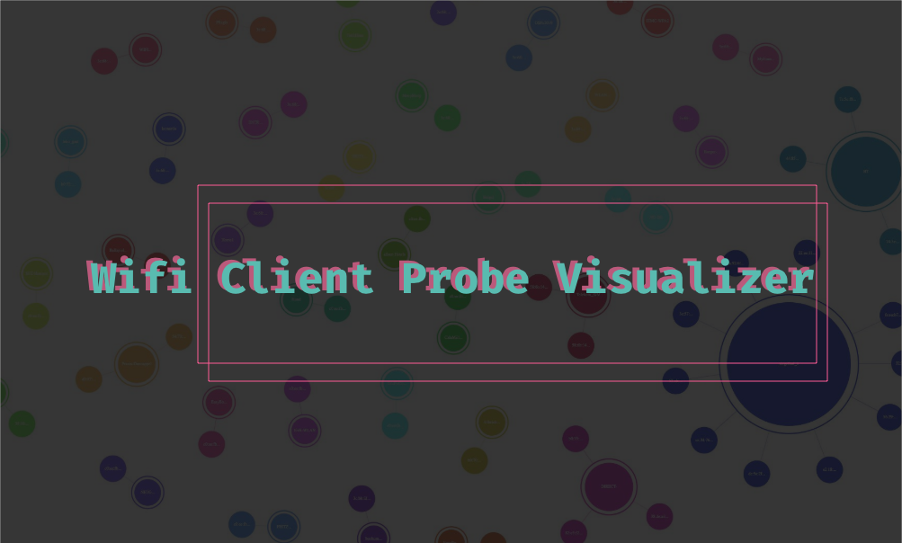

# Wifi client probe analyzer & visualizer

This is a small **hacked-together, afternoon** project.

The idea was, to show on a talk some cool visualization of data. Most android & iphoes are broadcasting management beacons to check if known networks are near by. You can easily sniff those packets and extract network names. And use them for evil twin attacks for example. Furthermore this concept works great for talks & meetups. Thus, alsways turn off your wifi and disable broadcast settings in the android settings.

This is a collection of scripts that will:

- Sniff beacons
- Save them to a log
- Generate a diagramm grouped by clients or networks.

## Requirements

Because this is rather a loose collection of scripts there are some requirements:

- nodejs
- python (or php for webserver)
- bettercap

Bettercap is used for the sniffing. It is my goto tool. You could easily do this with wireshark, tshark, tcpdump or whatever.

You will need nodejs for running the javascript files, which will be parsing the log file. My python skills are not brave enough to write everything in python. :o

You will however need some kind of webserver. Because the parsed logfile will be saved locally as a json. To access the file from javascript inside your browser, it must be serverd via a webserver.

On linux and mac you will mostly have python and php installed. So it will run `python -m SimpleHTTPServer 3000` in `start.sh`

You can change this to a php server if you want.

## Usage

1. Start collecting probes with bettercap: `sudo bettercap -iface en0 -no-colors -caplet client-probe-analyzer.cap`
2. Run `start.sh` in another terminal window.
3. Run `update.sh` to update your dataset.
4. Open your browser at `http://localhost:3000`

### Bettercap

Bettercap will capture the client probes and save it into a log file `client-probes.log`

### Start.sh

The script will run a `node parse.js` command, which will trigger the parsing of the log and outputs a json (`probes.json`)
Then it will start a small python webserver, so we can access the json from within the browser.

### Update.sh

Is basically just an alias for `node parse.js`
This means, the chart will be not **realtime**.
